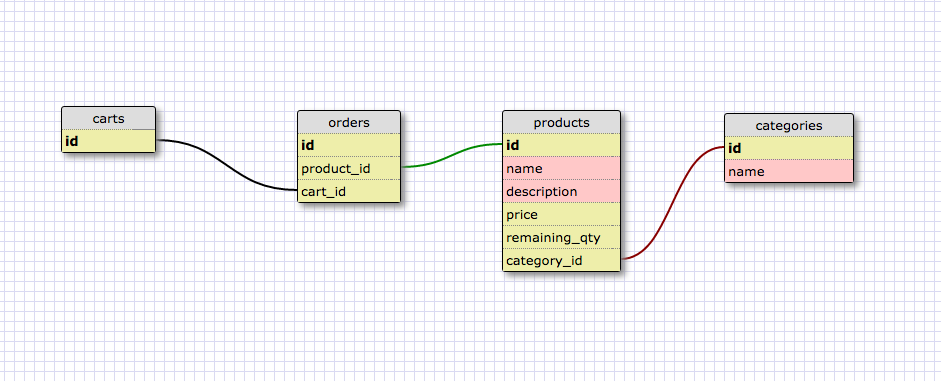
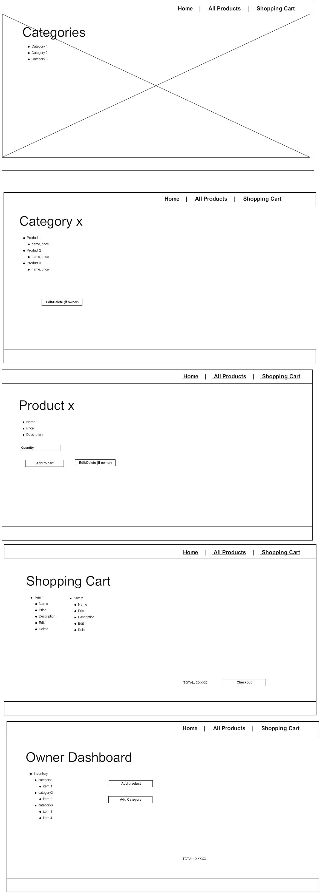

## Online Rails Shop

## Iteration 1
### User stories

1. User can view all products
2. User can add products to shopping cart
3. User can have multiple products in shopping cart
4. User can view the shopping cart at any time
5. User can checkout shopping cart
6. Shop owner can add products
7. Shop owner can view products
8. Shop owner can edit/delete products

### MVP

1. Schema
2. Wireframe
3. RSpec for controllers, models and views
4. HAML and SASS
5. Create rails app with all of the above
6. Deploy to Heroku with every feature

## Schema

## Wireframe

## Iteration 2
Requirements:

1. Quantity and price ($99.95)
2. Add `/admin` for administration 
3. Use `http_basic_authenticate_with_name` (admin, secret)
4. Create tabular inventory view
5. Hide admin features (edit, delete, etc)
6. Add style (SASS, Bootstrap)
7. Add flash error (green and red)

## Iteration 3
Requirements:

1. Add users and login with secure passwords
2. Add products and categories many to many associations
3. Show categories in products show page
4. Replace HTTP authentication with session authentication
5. Update tests for categories and authentication
6. Add ActionMailer to send email when a new user signs up
7. Add a user named "Tom" and an admin named "Tim"
